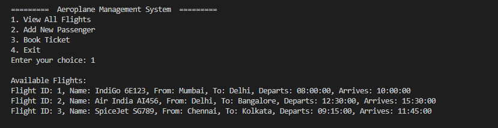
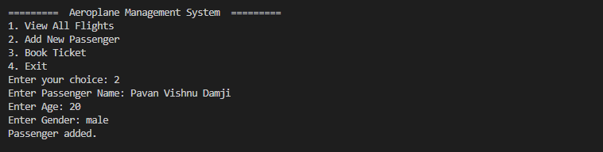
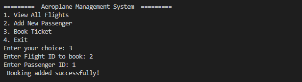

# ✈️ Aeroplane Management System

[](https://www.oracle.com/java/)
[](https://maven.apache.org/)
[](https://www.postgresql.org/)

## 📘 Introduction

Aeroplane Management System is a Java-based console project using JDBC, PostgreSQL, and Maven. It helps manage flights, passengers, and bookings in a simple and menu-driven format. It follows Object-Oriented Programming principles and uses a modular DAO architecture.

## 📑 Table of Contents

- [About](#about)
- [Features](#features)
- [Project Structure](#project-structure)
- [Installation](#installation)
- [Database Schema](#database-schema)
- [Dependencies](#dependencies)
- [Usage](#usage)
- [Screenshots](#screenshots)
- [Prerequisites](#prerequisites)
- [Future Enhancements](#future-enhancements)
- [Author](#author)

## 🔍 About

This console-based system allows:
- Viewing flight listings
- Adding new passengers
- Booking tickets by linking passengers and flights
- Storing all data in a PostgreSQL database with foreign key relations

## 🚀 Features

- View available flights
- Register new passengers
- Book flights (validated via foreign keys)
- Store and fetch data using JDBC
- Clean menu-based interaction
- Followed proper project structure with packages: `dao`, `model`, `util`, `impl`

## 📁 Project Structure

```
aeroplane-management-system/
├── src/
│   └── main/java/com/pavan/aeroplane/
│       ├── dao/
│       │   ├── BookingDAO.java
│       │   ├── FlightDAO.java
│       │   ├── PassengerDAO.java
│       ├── dao/impl/
│       │   ├── BookingDAOImpl.java
│       │   ├── FlightDAOImpl.java
│       │   ├── PassengerDAOImpl.java
│       ├── model/
│       │   ├── Booking.java
│       │   ├── Flight.java
│       │   ├── Passenger.java
│       ├── util/
│       │   ├── DatabaseConnection.java
│       │   ├── FileHandler.java
│       │   ├── TakeoffSimulator.java
│       └── Main.java
├── pom.xml
├── README.md
```

## 💻 Installation

```bash
# Clone the repository
git clone https://github.com/PavanDamji4/aeroplane-management-system.git

# Navigate into the folder
cd aeroplane-management-system

# Compile using Maven
mvn clean compile

# Run the project
mvn exec:java
```

## 🗃️ Database Schema

```sql
-- Flights Table
CREATE TABLE flights (
  flight_id SERIAL PRIMARY KEY,
  flight_name VARCHAR(100),
  source VARCHAR(50),
  destination VARCHAR(50),
  departure_time TIME,
  arrival_time TIME
);

-- Passengers Table
CREATE TABLE passengers (
  id SERIAL PRIMARY KEY,
  name VARCHAR(100),
  age INT,
  gender VARCHAR(10)
);

-- Bookings Table
CREATE TABLE bookings (
  booking_id SERIAL PRIMARY KEY,
  flight_id INT REFERENCES flights(flight_id),
  passenger_id INT REFERENCES passengers(id)
);
```

## 📦 Dependencies

```xml
<dependencies>
  <dependency>
    <groupId>org.postgresql</groupId>
    <artifactId>postgresql</artifactId>
    <version>42.7.3</version>
  </dependency>

  <dependency>
    <groupId>junit</groupId>
    <artifactId>junit</artifactId>
    <version>4.13.1</version>
    <scope>test</scope>
  </dependency>
</dependencies>
```

## 🧪 Usage

```bash
mvn exec:java
```

Follow the prompts in the console:

```
========= ✈ Aeroplane Management System ✈ =========
1. View All Flights
2. Add New Passenger
3. Book Ticket
4. Exit
```

- Choose an option (1-4)
- Add passengers, view flights, or book tickets
- Data will be saved to PostgreSQL

## 📸 Screenshots

### 🛫 Flight List


### 👤 Passenger Added


### 🎫 Booking Success



## ✅ Prerequisites

- Java JDK 17 or later
- Apache Maven 3.9+
- PostgreSQL 17+
- IntelliJ, Eclipse, or VS Code

## 🔮 Future Enhancements

- View all bookings
- View all passengers
- Cancel bookings
- Export records to CSV
- Add GUI with JavaFX or Swing
- Implement search and filters
- Add authentication/login system

## 👨‍💻 Author

**Jay Damji**  
GitHub: [@PavanDamji4](https://github.com/PavanDamji4)

---
